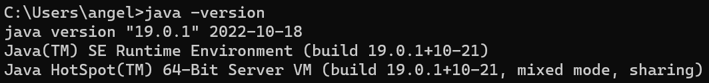
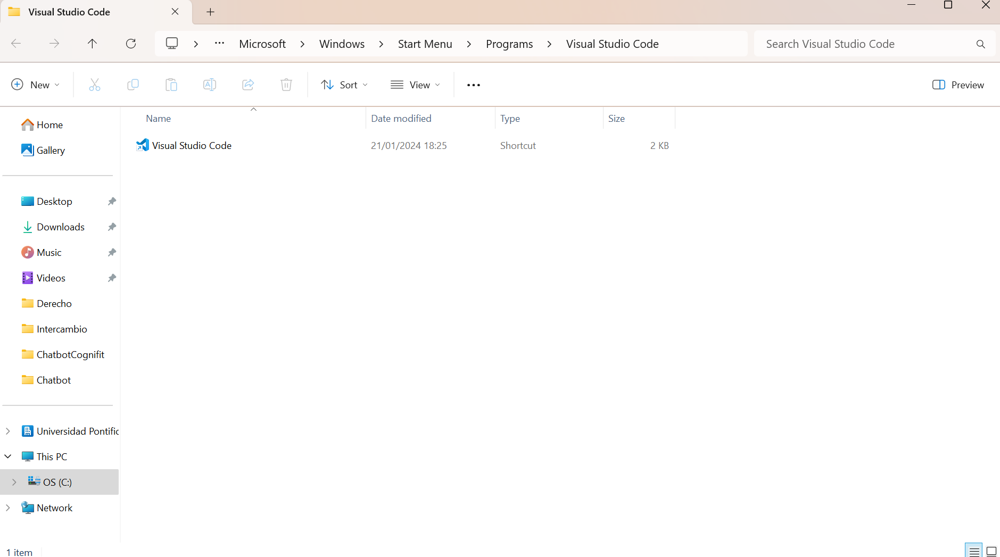

# Práctica 1

Un repositorio para empezar a usar [git](https://git-scm.com/) y Github

## ¿Como probar en la nube?

[Github-Codespaces](https://github.com/features/codespaces)

## Comandos git básicos

```
git clone https://github.com/gitt-3-pat/p1
git status
git add .
git commit -m "TU MENSAJE"
git push

git checkout -b feature/1
git checkout main
```

## ¿Cómo escribir un README.md con formato?

[Github Markdown](https://docs.github.com/es/get-started/writing-on-github/getting-started-with-writing-and-formatting-on-github/basic-writing-and-formatting-syntax)


### Resultado de la práctica
# En esta práctica se han probado los comandos básicos del terminal de github e instalado el software necesario. Empezaremos por describir qué hace cada comando probado:

    1. git clone: Este comando clona un repositorio dado en un enlace a tu máquina local.
	2. git status: Este comando nos da información sobre el estado de nuestro repositorio, mostrando archivos modificados, nuevos, etc.
	3. git add: Este comando se utiliza para agregar archivos a un área de preparación antes de hacer un commit. Se pueden agregar individualmente o todos juntos, como en el caso probado, con 'git add .'.
	4. git commit: Este comando guarda los cambios realizados previamente en el historial de preparación del repositorio.
	5. git push: Este comando se utiliza para subir los cambios locales al repositorio remoto.
	6. git checkout: Este comando se utiliza para cambiar entre ramas o versiones específicas de archivos. Seguido de -b sirve para crear y mandar a una nueva rama, mientras que sin el prefijo simplemente cambia a la rama indicada.
    
# Ahora dejamos las evidencias de la instalación del software necesario:

Aquí podemos comprobar que tenemos java instalado.


En esta imagen comprobamos que tenemos Maven añadido.


Aquí vemos como VSCode está instalado.


Por último, esta es la evidencia de la instalación de IntelliJ.